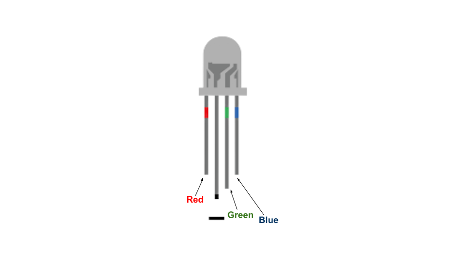
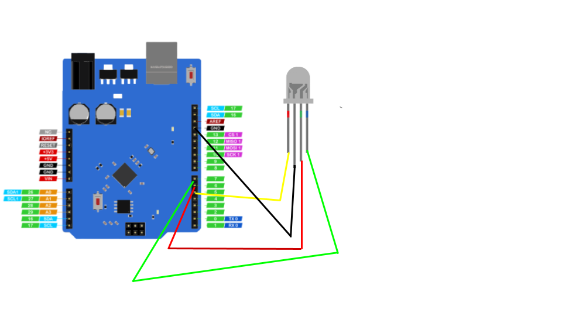

# RGB LED

We will glow some different colour on Rgb led

## hardware required

| Item                              | Quantity                          |
| --------------------------------- | --------------------------------: |
| **`UNO 2040 `**                   |  1                                |
| **`UNO 2040 USB cable`**          |  1                                |
| **`800pin Breadboard`**           |  1                                |
| **`RGB LED`**                     |  1                                |
| **`male to male jumpers`**        |  4                                |

<hr>

### About Pins Of RGB Led



### circuit diagram


<hr/>

!!! note
    The coloured lines represent male to male jumper cables  <br>
    Please Use Breadboard to connect the led in above diagram to explain we have not used the breadboard

### defining the pin 

```c++
int PIN_RED   = 5;
int PIN_GREEN = 6;
int PIN_BLUE  = 7;
```

we can make variable using this the code


### Defining led pin as output

defining the rgb led pin as output

```c++
void setup() {
  pinMode(PIN_RED,   OUTPUT);
  pinMode(PIN_GREEN, OUTPUT);
  pinMode(PIN_BLUE,  OUTPUT);}
```

### Main loop
```c++
void loop() {
  analogWrite(PIN_RED,   0);
  analogWrite(PIN_GREEN, 0);
  analogWrite(PIN_BLUE,  200);
  delay(1000); 
  analogWrite(PIN_RED,  200);
  analogWrite(PIN_GREEN, 0);
  analogWrite(PIN_BLUE,  0);
  delay(1000); 
  analogWrite(PIN_RED,   0);
  analogWrite(PIN_GREEN, 200);
  analogWrite(PIN_BLUE, 0);
  delay(1000);
  analogWrite(PIN_RED,   60);
  analogWrite(PIN_GREEN, 60);
  analogWrite(PIN_BLUE, 0);
  delay(1000);}
```
we will glow blue colour then red colour then green colour and yellow colour

## Complete code

Copy the complete code from below

??? example "Complete code" 
```c++
int PIN_RED   = 5;
int PIN_GREEN = 6;
int PIN_BLUE  = 7;
void setup() {
  pinMode(PIN_RED,   OUTPUT);
  pinMode(PIN_GREEN, OUTPUT);
  pinMode(PIN_BLUE,  OUTPUT);}
void loop() {
  analogWrite(PIN_RED,   0);
  analogWrite(PIN_GREEN, 0);
  analogWrite(PIN_BLUE,  200);
  delay(1000); 
  analogWrite(PIN_RED,  200);
  analogWrite(PIN_GREEN, 0);
  analogWrite(PIN_BLUE,  0);
  delay(1000); 
  analogWrite(PIN_RED,   0);
  analogWrite(PIN_GREEN, 200);
  analogWrite(PIN_BLUE, 0);
  delay(1000);
  analogWrite(PIN_RED,   60);
  analogWrite(PIN_GREEN, 60);
  analogWrite(PIN_BLUE, 0);
  delay(1000);} 
```
## Activity

!!! question
    Try to glow diffrent colour on it 
