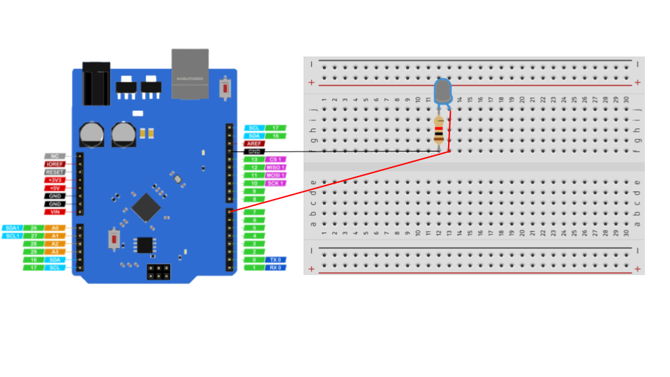

# LED blink circuit

The blinking LED circuit is like the electronics version of the “Hello World”-program. We'll be blinking a single LED with customizable intervals.

## hardware required

| Item                              | Quantity                          |
| --------------------------------- | --------------------------------: |
| **`UNO 2040 `**                   |  1                                |
| **`UNO 2040 USB cable`**          |  1                                |
| **`800pin Breadboard`**           |  1                                |
| **`LED (any colour)`**            |  1                                |
| **`male to male jumpers`**        |  2                                |

<hr>

## Blinking on-board LED

UNO 2040 has an on-board led internally connected to D13 pin. 

### Defining the led pin

``` c++
int led_pin = 13
```

### Setting pin as output

The next thing we need to do is to define the pin as output using the following syntax.

```c++
void setup() {
  pinMode(led_pin, OUTPUT);
}
```

### Main loop

The last thing to do is to repeatedly turn the led on and off inside **```void loop()``` ** loop.

``` c++
void loop() {
  digitalWrite(led_pin, HIGH);  
  delay(500);                      
  digitalWrite(led_Pin, LOW);  
  delay(500);                      
}
```

click on **`upload`** icon and the code will upload in uno2040 and start running and you can see the on-board led start blinking.

!!! note

`delay(500);` denotes the number of micro seconds. Increasing the number will make the blinking effect slower and vice versa.

Go ahead and try a different value, something like:

``` c++
void loop() {
  digitalWrite(led_pin, HIGH);  
  delay(1000);                     
  digitalWrite(led_pin, LOW);   
  delay(500);                      
```

and click **`upload`**. You'll notice a different blink pattern.

<hr/>

Copy the complete code from below.

??? example "Complete code"
``` c++
int led_pin = 13
void setup() {
  pinMode(LED_BUILTIN, OUTPUT);
}
void loop() {
  digitalWrite(LED_BUILTIN, HIGH);
  delay(1000);                    
  digitalWrite(LED_BUILTIN, LOW);  
  delay(1000);                      
}
```


## blinking an external LED

We'll be connecting an LED (any colour) to D7 according to the circuit diagram below.

!!! info
    D13 can be replaced with any available Digital pin (refer to the [introduction](index.md#pinout-and-pin-definitions) page for full list of available Digital Pin )

### circuit diagram


<hr/>

!!! note
    The coloured lines represent male to male jumper cables.

### code changes

we only need to change the digtal pin number from **`D13`** to **`D7`** in the following line.

```c++
int led_pin = 7
void setup() {
  pinMode(LED_BUILTIN, OUTPUT);
}
void loop() {
  digitalWrite(LED_BUILTIN, HIGH);
  delay(1000);                    
  digitalWrite(LED_BUILTIN, LOW);  
  delay(1000);                      
}
```

## Complete code

Copy the complete code from below

??? example "Complete code"
``` c++
 int led_pin = 7
 void setup() {
  pinMode(LED_BUILTIN, OUTPUT);
}
void loop() {
  digitalWrite(LED_BUILTIN, HIGH);
  delay(1000);                    
  digitalWrite(LED_BUILTIN, LOW);  
  delay(1000);                      
}
```


## Activity

!!! question
    Try mixing and matching blinking using multiple leds and multiple blink patterns.
