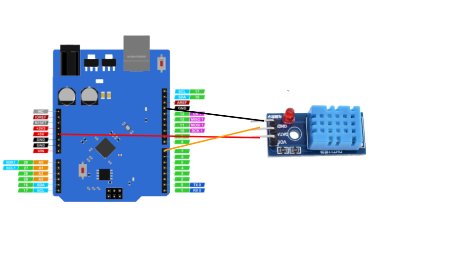

# Humidity and Temperature

Humidity and Temperature Using DHT11 Sensor 

## hardware required

| Item                              | Quantity                          |
| --------------------------------- | --------------------------------: |
| **`UNO 2040 `**                   |  1                                |
| **`UNO 2040 USB cable`**          |  1                                |
| **`800pin Breadboard`**           |  1                                |
| **`DHT11 Sensor`**                     |  1                                |
| **`male to male jumpers`**        |  4                                |

<hr>


### circuit diagram


<hr/>

!!! note
    The coloured lines represent male to male jumper cables  <br>
    Please Use Breadboard to connect the DTH11 Sesnor in above diagram to explain we have not used the breadboard

### defining the pin , sensor , sesnor type and libary

```c++
#include "DHT.h"
int DHTPIN = 7 ;
int DHTTYPE = DHT11 ;
DHT dht(DHTPIN, DHTTYPE);
```
 definiinb sensor data pin , sensor type and sensor and  the libary

!!! note
    Please Install adafruit dht libary


### Setting up sensor and serial monitor

setting up serial monitor and sensor 

```c++
void setup() {
  Serial.begin(9600);
  dht.begin(); }
```

### Main loop
```c++
void loop() {
  delay(2000);
  float humi  = dht.readHumidity();
  float tempC = dht.readTemperature();
  if (isnan(humi) || isnan(tempC) ) {
    Serial.println("Failed to read from DHT sensor!");
  } else {
    Serial.print("Humidity: ");
    Serial.print(humi);
    Serial.print("%");
    Serial.print("  |  "); 
    Serial.print("Temperature: ");
    Serial.print(tempC);
    Serial.print("°C ~ ");
  }}

```
reading humidity value and temperature from sensor and printing it on serial monitor

## Complete code

Copy the complete code from below

??? example "Complete code" 
```c++
#include "DHT.h"
int DHTPIN = 7 ;
int DHTTYPE = DHT11 ;
DHT dht(DHTPIN, DHTTYPE);
void setup() {
  Serial.begin(9600);
  dht.begin(); }
void loop() {
  delay(2000);
  float humi  = dht.readHumidity();
  float tempC = dht.readTemperature();
  if (isnan(humi) || isnan(tempC) ) {
    Serial.println("Failed to read from DHT sensor!");
  } else {
    Serial.print("Humidity: ");
    Serial.print(humi);
    Serial.print("%");
    Serial.print("  |  "); 
    Serial.print("Temperature: ");
    Serial.print(tempC);
    Serial.print("°C ~ ");
  }}
```
## Activity

!!! question
    Try to print temperature in fahrenheit
