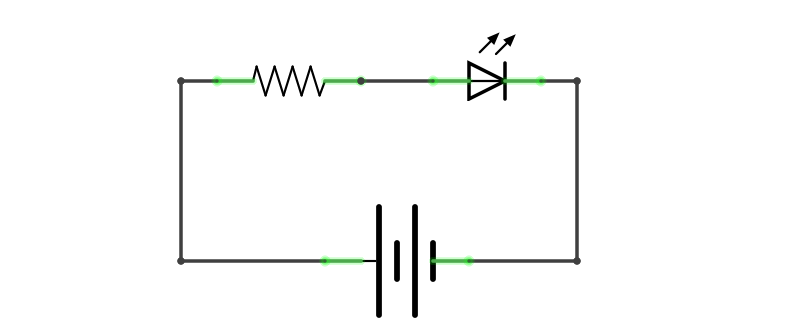
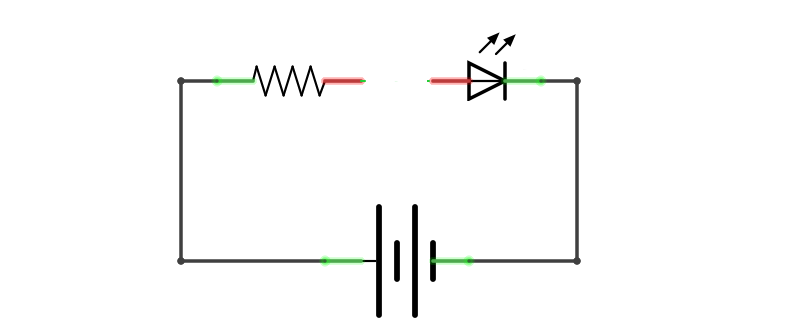
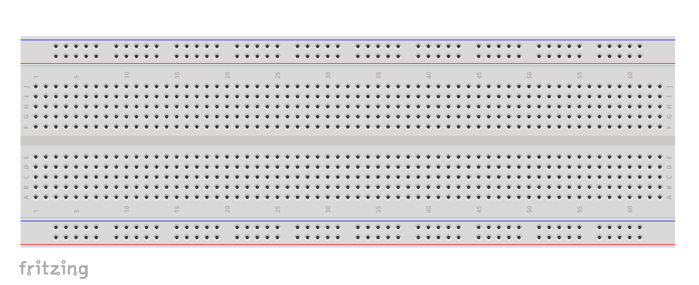
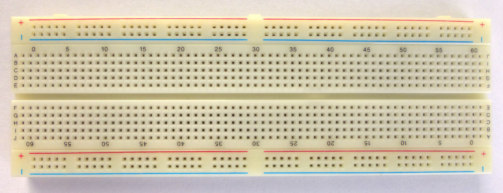

# **Crash crouse on electronics**

## **Definition**

Electronics is the study and use of electrical parts and circuits. These "electronic components" control electricity for useful purposes.

Electronic devices have many electronic components such as - resistors, capacitors, coils of wire called inductors, integrated circuits, connection wires and circuit boards.

!!! info
    This page covers the most basic definition of electronics and explain the topic well enough to be able to preform experiments/projects provided in this kit.

## **Simple electronic circuit**

Electronic circuits usually use direct current sources. The load of an electronic circuit may be as simple as a few resistors, capacitors, and a lamp, all connected together to create the flash in a camera. Or an electronic circuit can be complicated, connecting thousands of resistors, capacitors, and transistors. It may be an integrated circuit such as the microprocessor in a computer.

Resistors and other circuit elements can be connected in series or in parallel. Resistance in series circuits is the sum of the resistance.

<figure>
  
  <figcaption><b>Fig:</b> Electronic circuit (closed)</figcaption>
</figure>

Diagram above shows a simple electronics circuit, consists of three main components

* **L.E.D.**

* **Resistor**

* **Battery**

These components are connected in such a way that it completes the `circuit` making the current flow. This is what we call a closed circuit.

!!! info

    Scroll down for detailed explaination on all three components.

 

What would happen if we break any wire connection in the above shown circuit? The circuit will simply stop working. As shown in the diagram below, This is what we call an open circuit. Where no current flow though.

<figure>
  
  <figcaption><b>Fig:</b> Electronic circuit (open)</figcaption>
</figure>

!!! note "Conclusion" 
    a circuit must always be a closed circuit to be able to function.

## **Protoyping tools**

### **Breadboard**

Breadboard is an electronic tool which can be used to test electrical circuits. In that case soldering is not needed. A breadboard is a construction base for prototyping of electronics.

Because the solderless breadboard does not require soldering, it is reusable. This makes it easy to use for creating temporary prototypes and experimenting with circuit design. For this reason, solderless breadboards are also extremely popular with students and in technological education.

#### **Layout**

The layout of a typical solderless breadboard is made up from two types of areas, called strips. Strips consist of interconnected electrical terminals.

<figure>
  
  <figcaption><b>Fig:</b> 800-pin Breadboard</figcaption>
</figure>

#### **Terminal strips**

The main areas, to hold most of the electronic components.

In the middle of a terminal strip of a breadboard, one typically finds a notch running in parallel to the long side. The notch is to mark the centerline of the terminal strip and provides limited airflow (cooling) to DIP ICs straddling the centerline. The clips on the right and left of the notch are each connected in a radial way; typically five clips (i.e., beneath five holes) in a row on each side of the notch are electrically connected. The five rows on the left of the notch are often marked as A, B, C, D, and E, while the ones on the right are marked F, G, H, I and J. 

#### **Bus Strips**

To provide power to the electronic components.

A bus strip usually contains two rows: one for ground and one for a supply voltage. However, some breadboards only provide a single-row power distributions bus strip on each long side. Typically the row intended for a supply voltage is marked in red, while the row for ground is marked in blue or black.

Bus strips typically run down one or both sides of a terminal strip . On large breadboards bus strips can often be found on both the top and bottom of terminal strips.

Let us take a look at what a breadboard looks like in real life.

<figure>
  
  <figcaption><b>Fig:</b> Real image of 800-pin Breadboard</figcaption>
</figure>

