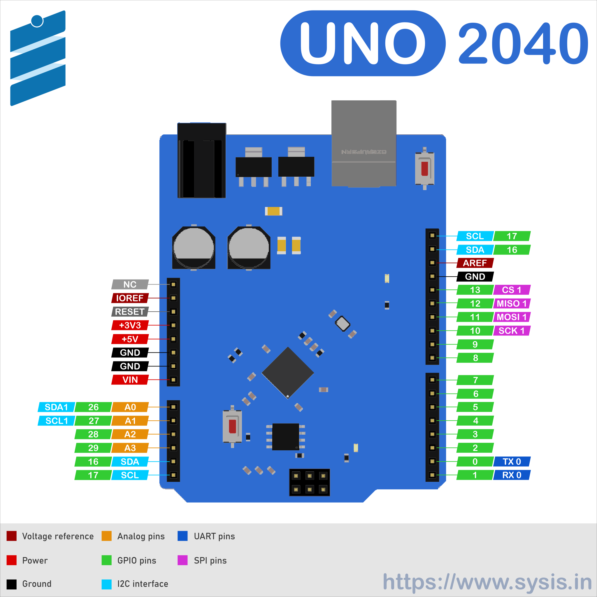

# Welcome

 {{ config.site_name }} is a development board which comes in arduino uno form factor that we all know and love. Which means it's 1-1 pin compatible with Arduino Uno R3. it's mostly a drop-in replacement for the existing Arduino Uno, So the existing shields meant for arduino uno can also be used with it.

<!-- [Register your  {{ config.site_name }} to get priority support](https://register.sysis.in){ .md-button } -->

## **Get to know your {{ config.site_name }} (Technical specifications)**

The heart of the board is Raspberry pi's RP2040 microcontroller. It's is a low-cost, high-performance microcontroller board with flexible digital interfaces. Key features include:

* RP2040 microcontroller chip designed by Raspberry Pi in the United Kingdom
* Dual-core Arm Cortex M0+ processor, flexible clock running up to 133 MHz
* 264KB of SRAM, and 2MB of on-board Flash memory
* Castellated module allows soldering direct to carrier boards
* USB 1.1 with device and host support
* Low-power sleep and dormant modes
* Drag-and-drop programming using mass storage over USB
* 26 × multi-function GPIO pins
* 2 × SPI, 2 × I2C, 2 × UART, 3 × 12-bit ADC, 16 × controllable PWM channels
* Accurate clock and timer on-chip
* Temperature sensor
* Accelerated floating-point libraries on-chip
* 8 × Programmable I/O (PIO) state machines for custom peripheral support

<!-- !!! info
    See the [Product page](https://www.raspberrypi.org/documentation/rp2040/getting-started/#board-specifications){target = _blank} for further details. -->

## **pinout and pin definitions**

[View full resolution image in a new tab](assets/pinout.svg){ .md-button target = _blank}

## **Supported Programming languages**

The main focus of  {{ config.site_name }} is to teach python which means we'll be programming all of our projects using python programming language. However, Raspberry pi pico supports the following programming languages:

* **`Arduino IDE`** - Good ol' arduino programming language that we know and love.
* **`Micropython`** - It is a full implementation of the Python 3 programming language that runs directly on embedded hardware like Raspberry Pi Pico.
* **`Circuitpython`** - It is a port of Micropython developed by Adafruit Industries that has way more features than standard Micropython build.
* **`C/C++ SDK`** - Native software development kit that runs on C/C++ programming language.
