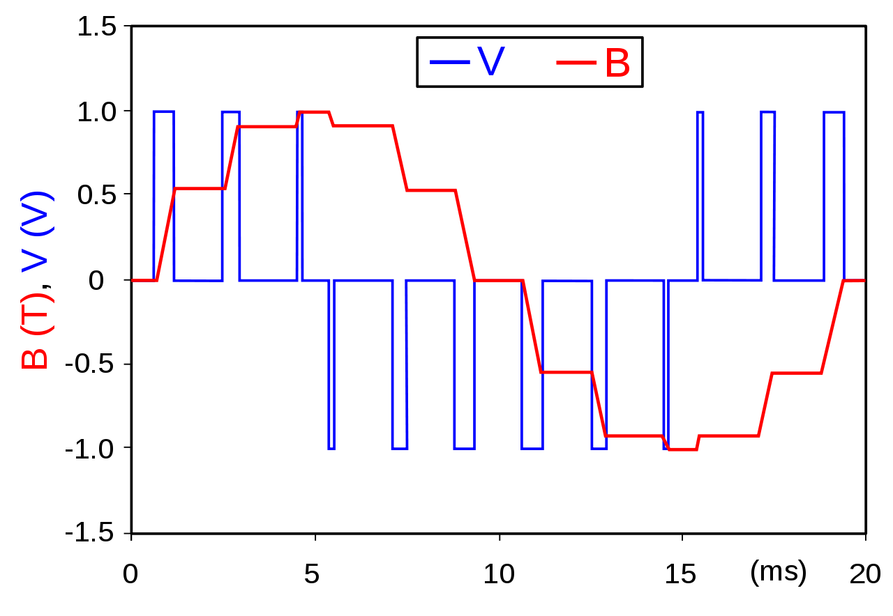

# **Technical jargon**

## **IDE**

An integrated development environment is a software application that provides comprehensive facilities to computer programmers for software development. An IDE normally consists of at least a source code editor, build automation tools and a debugger.

## **Firmware vs Software**

### **Firmware**

In computing, firmware is a specific class of computer software that provides the low-level control for a device's specific hardware. Firmware can either provide a standardized operating environment for more complex device software (allowing more hardware-independence), or, for less complex devices, act as the device's complete operating system, performing all control, monitoring and data manipulation functions.

### **Software**

Software is a collection of instructions and data that tell a computer how to work. This is in contrast to physical hardware, from which the system is built and actually performs the work. In computer science and software engineering, computer software is all information processed by computer systems, including programs and data. Computer software includes computer programs, libraries and related non-executable data, such as online documentation or digital media. Computer hardware and software require each other and neither can be realistically used on its own.

## **Inputs**

In computer science, the general meaning of input is to provide or give something to the computer, in other words, when a computer or device is receiving a command or signal from outer sources, the event is referred to as input to the device.

### **Digital**

The word digital comes from the same source as the words digit and digitus (the Latin word for finger), as fingers are often used for counting. The term is most commonly used in computing and electronics, especially where real-world information is converted to binary numeric form as in digital audio and digital photography.

### **Analog**

An analog signal is any continuous signal for which the time-varying feature of the signal is a representation of some other time-varying quantity, i.e., analogous to another time-varying signal. For example, in an analog audio signal, the instantaneous voltage of the signal varies continuously with the pressure of the sound waves.

## **outputs**

An output device is any piece of computer hardware equipment which converts information into human read able form. It can be text, graphics, tactile, audio, and video.

### **Digital**

!!! info
    Same as [above](#digital).

### **analog (PWM)**

Pulse width modulation (PWM), is a method of reducing the average power delivered by an electrical signal, by effectively chopping it up into discrete parts. The average value of voltage (and current) fed to the load is controlled by turning the switch between supply and load on and off at a fast rate. The longer the switch is on compared to the off periods, the higher the total power supplied to the load.

The rate (or frequency) at which the power supply must switch can vary greatly depending on load and application. For example, switching has to be done several times a minute in an electric stove; 120 Hz in a lamp dimmer; between a few kilohertz (kHz) and tens of kHz for a motor drive; and well into the tens or hundreds of kHz in audio amplifiers and computer power supplies. The main advantage of PWM is that power loss in the switching devices is very low.

## **Serial communication**

Serial communication (also called RS232 communication) enables a microcontroller to be connected to another microcontroller or to a PC using a serial cable. Some microcontrollers have built-in hardware called universal synchronous–asynchronous receiver–Transmitter (UART) to implement a serial communication interface. The baud rate (bits per second) and the data format can usually be selected by the user program. If any serial I/O hardware is not provided, it is easy to develop software to implement serial data communication using any I/O pin of a microcontroller.