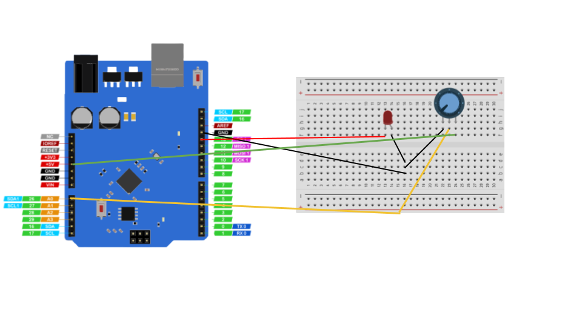

# LED Brightness control

In this activity, we'll be controlling brightness of an LED using potentiometer

## hardware required

| Item                              | Quantity                          |
| --------------------------------- | --------------------------------: |
| **`UNO 2040 `**                   |  1                                |
| **`UNO 2040 USB cable`**          |  1                                |
| **`800pin Breadboard`**           |  1                                |
| **`LED (any colour)`**            |  1                                |
| **`male to male jumpers`**        |  5                                |
| **`Potentiometer`**               |  1                                |

<hr>

### circuit diagram


<hr/>

!!! note
    The coloured lines represent male to male jumper cables.

### defining the pin 


```c++
int LED_PIN = 13; 
```

we can make variable using this the code

### Defining led pin as output

defining the led pin 

```c++
void setup() {
  pinMode(LED_PIN, OUTPUT);}
}
```

### Main loop
```c++
void loop() {
  int analogValue = analogRead(A0);
  int brightness = map(analogValue, 0, 1023, 0, 255);
  analogWrite(LED_PIN, brightness);}
```
Reading the value from potentiometer and controling the brightness of led

## Complete code

Copy the complete code from below

??? example "Complete code" 
```c++
int LED_PIN = 13; 
void setup() {
  Serial.begin(9600);
  pinMode(LED_PIN, OUTPUT);}
void loop() {
  int analogValue = analogRead(A0);
  int brightness = map(analogValue, 0, 1023, 0, 255);
  analogWrite(LED_PIN, brightness);}
```
## Activity

!!! question
    Try to it with buzzer
