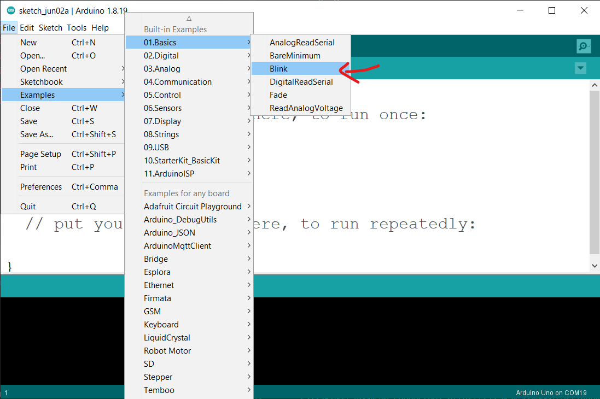

# Setting up arduino IDE to work with {{ config.site_name }}

The following guide assumes that you've already installed the arduino IDE from the official arduino website.

## **Installing via Arduino Boards Manager**

Windows Users: Please do not use the Windows Store version of the actual Arduino application because it has issues detecting attached Pico boards. Use the "Windows ZIP" or plain "Windows" executable (EXE) download direct from https://arduino.cc. and allow it to install any device drivers it suggests. Otherwise the {{ config.site_name }} may not be detected. Also, if trying out the 2.0 beta Arduino please install the release 1.8 version beforehand to ensure needed device drivers are present.

Open up the Arduino IDE and go to File->Preferences.

In the dialog that pops up, enter the following URL in the "Additional Boards Manager URLs" field:

``` 
https://github.com/suraj022/arduino-pico/releases/download/2.1.2/package_rp2040_index.json
```
<hr>


<hr>

!!! info
    Multiple boards urls can be seperated with commas.

!!! info
    Click here to visit the github page.

<hr>

Hit 'OK' to close the dialog.

Go to Tools->Boards->Board Manager in the IDE

Type "uno-2040" in the search box and select "Add":


## First time code upload.

* **hardware required**

| Item                              | Quantity                          |
| --------------------------------- | --------------------------------: |
| **`Sysis Uno-2040`**           |  1                                |
| **`USB type-B cable`**             |  1                                |
<hr>

* **Step 1:**

    * Connect your {{ config.site_name }} to the computer using a usb type-b cable.
        
        <!-- 
        <hr/>
        
        <hr/> -->
    
    * Press and hold BOOTSEL button on the {{ config.site_name }}, then press the reset button.

        <!-- 
        <hr/> -->

    * It'll show-up as a removable disk drive with the name `RPI-RP2`.

        {: style="width:300px"}

        !!! bug
            Even thought the drive shows 127 MB of total usable storage, Raspberry pi pico only sports 2 MB of internal storage. and while using Circuitpython firmware, only about 0.98 MB is available to users.

        <hr/>


* **Step 2:**
    
    * Open up arduino IDE and select `Sysis Uno-2040` from boards menu.

        
        <hr/>

    * Select `Blink` program from examples and hit upload.

        !!! info
            At this point the IDE will not detect any port connected to the COM port. This is normal behaviour.

        
        <hr/>
        
        <hr/>

    * Once the upload is finished, device will restart and the arduino is successfully installed onto the board. You may now select the appropriate port from the ports menu.

        
        <hr/>
        
        <hr/>

    Congratulations! and welcome the the world of arduino.