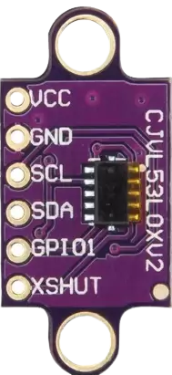
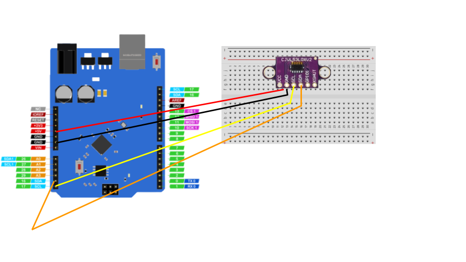

# Distance using ultrasonic sensor

We will measure distance using VL53L0X Sensor 

## hardware required

| Item                              | Quantity                          |
| --------------------------------- | --------------------------------: |
| **`UNO 2040 `**                   |  1                                |
| **`UNO 2040 USB cable`**          |  1                                |
| **`800pin Breadboard`**           |  1                                |
| **`VL53L0X Sensor `**             |  1                                |
| **`male to male jumpers`**        |  4                                |

<hr>

## About VL53L0Z


The VL53L0X is a new generation Time-of-Flight (ToF) laser-ranging module providing accurate distance measurement whatever the target reflectances, unlike conventional technologies.


### Circuit diagram

<hr/>
!!! note
    The coloured lines represent male to male jumper cables.


### Importing libary and making variable 

``` c++
#include "Adafruit_VL53L0X.h"
Adafruit_VL53L0X lox = Adafruit_VL53L0X();
```
!!! note
     Install Adafruit VL53L0X Libary

### Setting up serial monitor and VL53L0X sensor


```c++
void setup() {
  Serial.begin(115200);
  // wait until serial port open for native USB devices
  while (! Serial) {
    delay(1);
  }
  Serial.println("Adafruit VL53L0X test");
  if (!lox.begin()) {
    Serial.println(F("Failed to boot VL53L0X"));
    while(1);
  }
  // power 
  Serial.println(F("VL53L0X API Simple Ranging example\n\n")); 
}
```

### Main loop


``` c++
void loop() {
  VL53L0X_RangingMeasurementData_t measure;
  Serial.print("Reading a measurement... ");
  lox.rangingTest(&measure, false); // pass in 'true' to get debug data printout!
  if (measure.RangeStatus != 4) {  // phase failures have incorrect data
    Serial.print("Distance (mm): "); Serial.println(measure.RangeMilliMeter);
  } else {
    Serial.println(" out of range ");
  }
  delay(100);
}
```

click on **`upload`** icon and the code will upload in uno2040 and open serial monitor you will see the distance from sensor in serial monitor


## Complete code
Copy the complete code from below
??? example "Complete code"
``` c++
#include "Adafruit_VL53L0X.h"
Adafruit_VL53L0X lox = Adafruit_VL53L0X();
void setup() {
  Serial.begin(115200);
  while (! Serial) {
    delay(1);
  }
  Serial.println("Adafruit VL53L0X test");
  if (!lox.begin()) {
    Serial.println(F("Failed to boot VL53L0X"));
    while(1);
  }
  Serial.println(F("VL53L0X API Simple Ranging example\n\n")); 
}
void loop() {
  VL53L0X_RangingMeasurementData_t measure; 
  Serial.print("Reading a measurement... ");
  lox.rangingTest(&measure, false); 
  if (measure.RangeStatus != 4) { 
    Serial.print("Distance (mm): "); Serial.println(measure.RangeMilliMeter);
  } else {
    Serial.println(" out of range ");
  }
  delay(100);
}
```
## Activity
!!! question
    Try printing distances in meters
